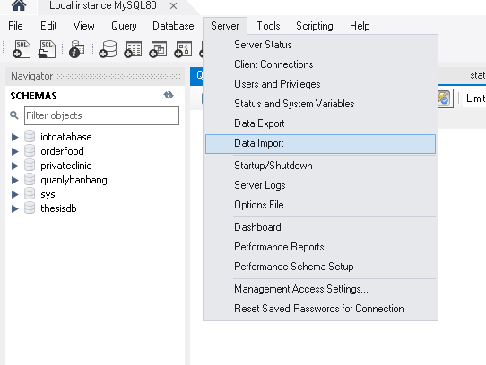
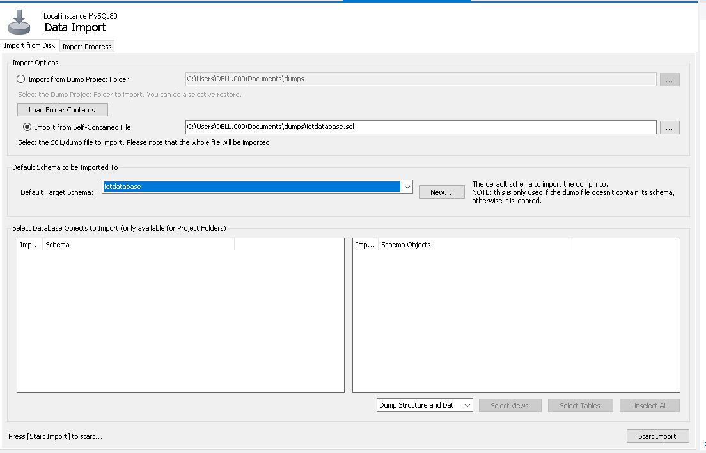

# Hướng dẫn cài đặt

# Server
Bước 1: Cài đặt Hệ quản trị cơ sở dữ liệu MySQL, tạo database tên "iotdatabase" 

Bước 2: import dữ liệu vào database

Bước 3: Mở file Server bằng IDE đã cài đặt ngôn ngữ Java.

Bước 4: Vào tập tin theo hình theo hình

Bước 5: Config các thông tin username và password đã set trong hệ quản trị cơ sở dữ liệu MySQL.

Bước 6: Chạy chương trình

# Client
Bước 1: Mở folder client bằng visual studio code.

Bước 2: Bật terminal của visual code và gõ lệnh "npm i" và enter

Bước 3: Chạy client bằng lệnh "npm start" và enter

# Lưu ý
Luôn luôn chạy phía server trước khi chạy client
